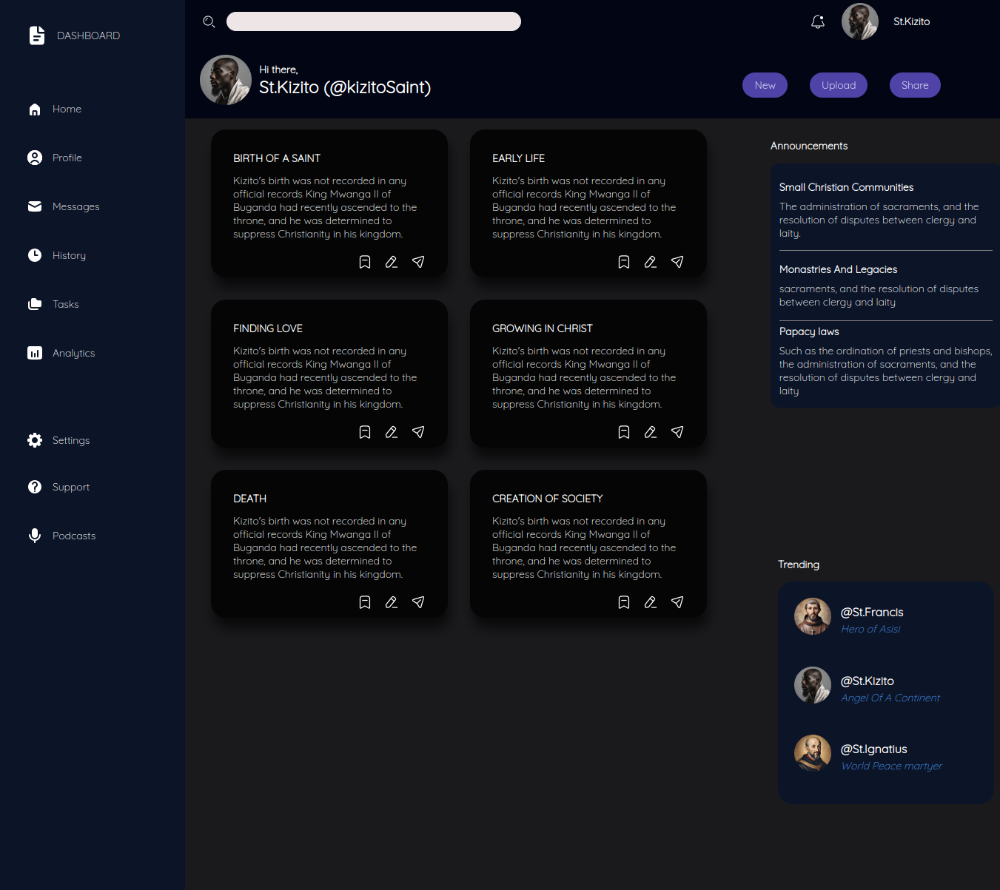

# Admin Dashboard

        > *Screenshot of dashboard taken using chrome dev tools*
        

## Short Description 🎲

 An Admin dashboard built and architectured using HTML and Vanilla Css. Utilizing mostly the Css layout feature, Grid.Additional to the grid layout, it also includes flexbox layout styling.

 ## Demo 🚴
 click [Live Preview](https://mtendekuyokwa19.github.io/AdminDashboard/) to check it out!

 ## Technologies and Tools 	🔧

 1. HTML
 2. vanilla CSS
 3. Chrome Dev tools
 4. Git
 5. Google fonts
 6. Figma And Figma community
 7. Poe Image Generator

 ## What I learned 🎓
 - Working with grid layout styling
 - Co-existing css grid and flexbox
 - setting up layouts with icons

 ## Motivation 🧠
 The core motivation was managing and practicinf a new tool,grid. Even though this is not corpate sized project I've learnt and practiced a very essential tool.

 ## Credits 🤝

 - [Google Fonts](https://fonts.google.com/specimen/Quicksand?query=Quicksand).

 - [Figma Icon pack](https://www.figma.com/file/Amhp6krq5augNYnXbcs9Wm/Huge-Icon-Pack---Free-Version-(150%2B-Icons)-(Community)?type=design&node-id=2852-11494&mode=design&t=TvJ9l9YAJZBzSJoL-0)

 - [Image generator](https://poe.com/Photo_magic)

